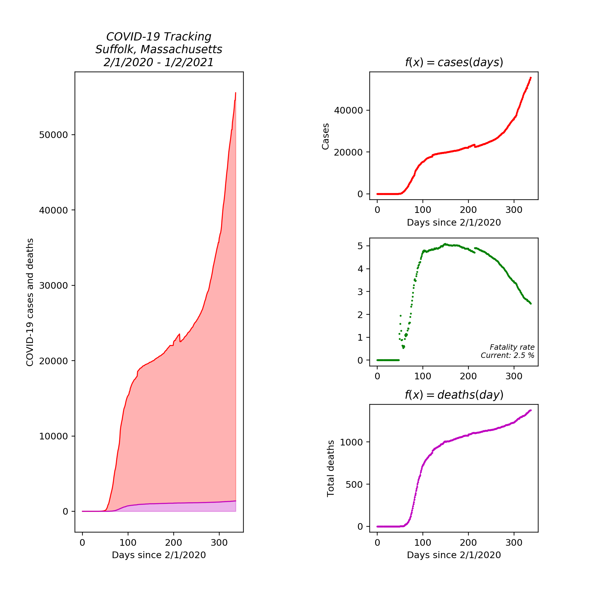

# dailycovid - Easily get covid updates

# Pypi installation
`pip3 install dailycovid`

# Usage

To get the plots for every county in a state.

`dailycovid -state ny`

Or by county.

`daily covid -state CA -county "Los Angeles" -getdata`

# Examples of plots

