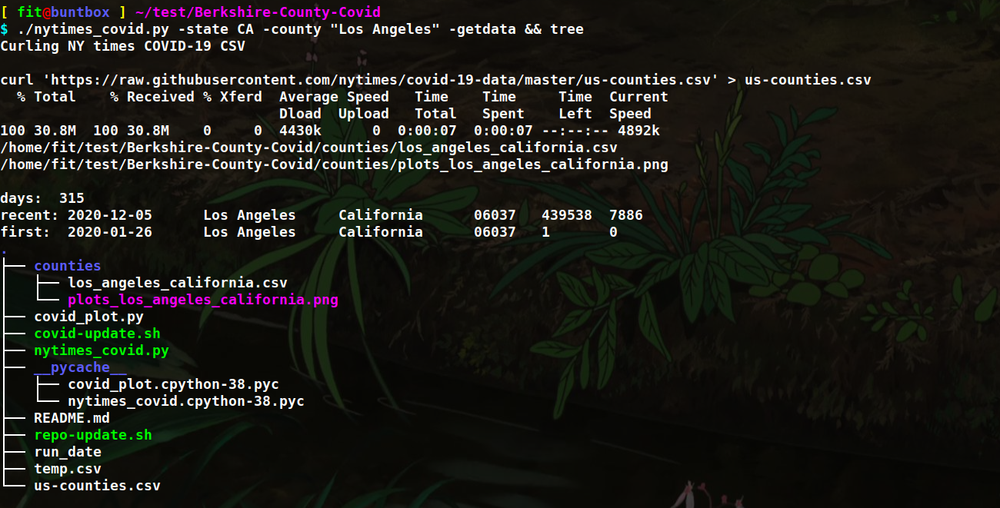
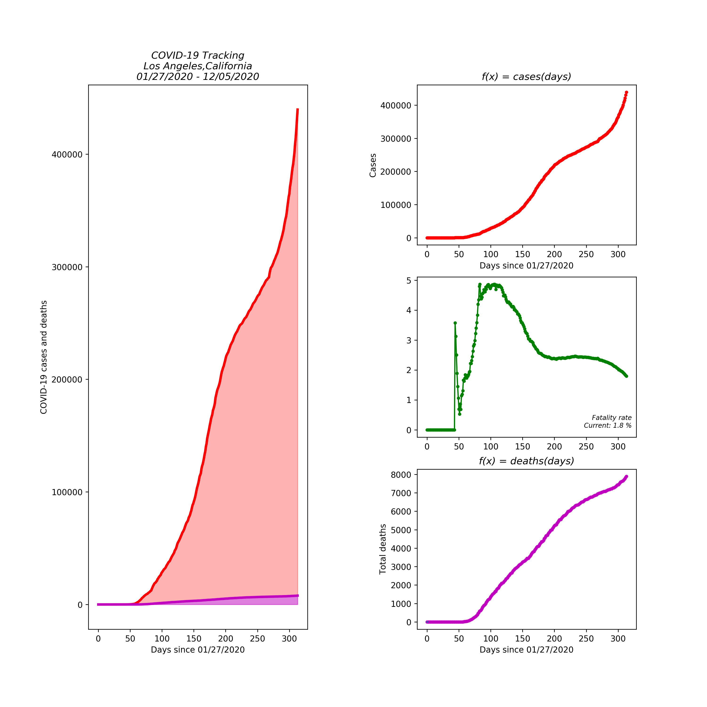
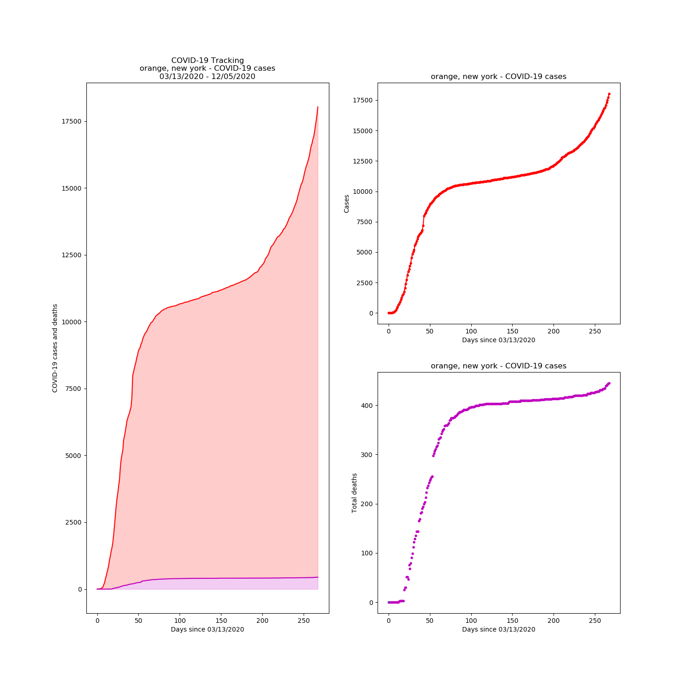

# daily-covid

Use the New York Time's covid data to get up to date county info.

Plots daily deltas given a county and a state.

`pip3 install matplotlib numpy`

`git clone https://github.com/Fitzy1293/daily-covid.git`

`cd daily-covid`

`python3 nytimes_covid.py -state CA -county "Los Angeles" -getdata`

Now that you have an updated list of us-counties.csv, you don't need to run the `-getdata` argument.

For example you could now do this.

`python3 nytimes_covid.py -state ny -county "orange"`

# Example

