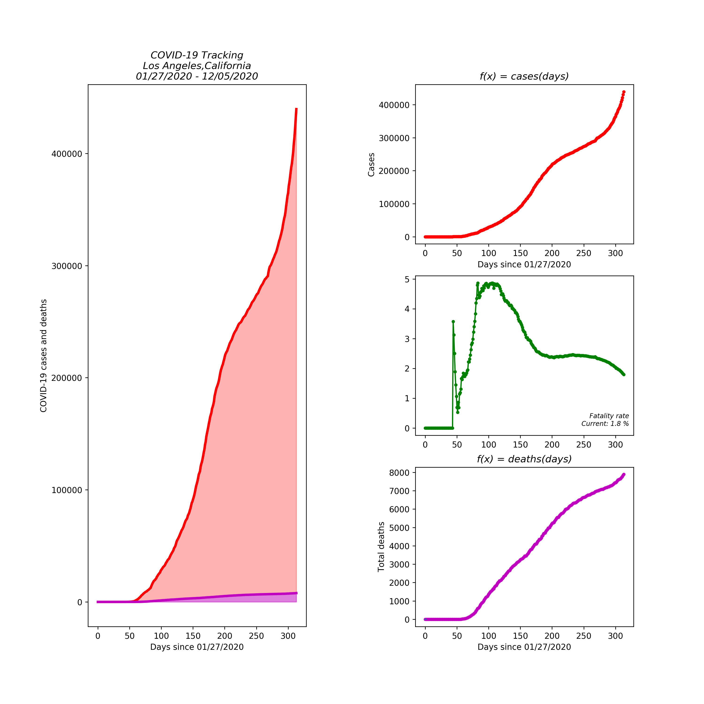
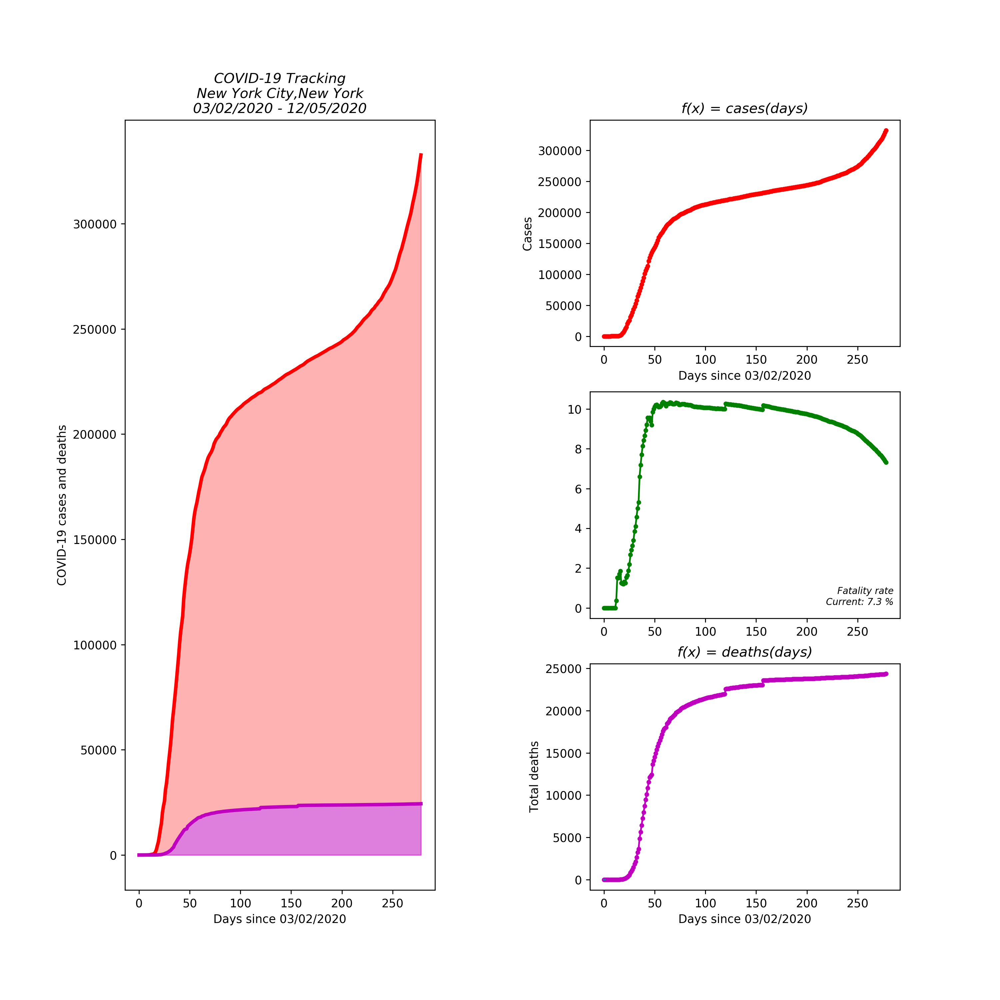

# dailycovid - Easily get covid updates

# Pypi installation
`pip3 install dailycovid`

# Usage

`python3 nytimes_covid.py -state CA -county "Los Angeles" -getdata`

Now that you have an updated list of us-counties.csv, you don't need to run the -getdata argument.

For example you could now do this.

`python3 nytimes_covid.py -state ny -county "orange"`

# Examples of plots

